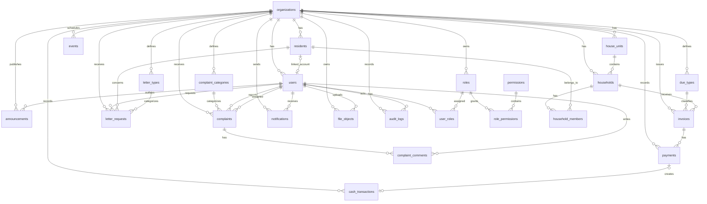

# Desain Database dan ERD

**Status:** Draft untuk validasi  
**RDBMS:** PostgreSQL 18.4  
**Cakupan:** MVP RT Digital  
**Referensi:** `PRD.md`, `SCOPE.md`, `USER_ROLES_AND_PERMISSIONS.md`, `USER_FLOW.md`

---

## 1. Konvensi Desain

- Seluruh entitas bisnis memakai primary key `UUID`.
- Gunakan UUID v7 bila tersedia pada library aplikasi; UUID v4 tetap dapat digunakan.
- Nama tabel dan kolom menggunakan `snake_case`.
- Waktu disimpan sebagai `TIMESTAMPTZ` dalam UTC.
- Tanggal bisnis tanpa waktu memakai `DATE`.
- Nominal uang memakai `NUMERIC(15,2)`, tidak memakai `FLOAT`.
- Semua tabel operasional memiliki `organization_id` untuk isolasi tenant.
- Data penting tidak dihapus permanen. Gunakan `status`, `archived_at`, pembatalan, atau transaksi pembalik.
- `created_at` dan `updated_at` wajib tersedia pada tabel yang dapat diubah.
- `updated_at` diperbarui melalui trigger database atau aplikasi secara konsisten.
- Status disimpan sebagai `VARCHAR` dengan `CHECK` constraint pada migration awal. PostgreSQL enum dapat dipertimbangkan setelah status stabil.
- NIK dan nomor KK disimpan terenkripsi. Pencarian memakai blind index, bukan ciphertext.
- Master data per organisasi wajib memakai `organization_id`; penonaktifan, bukan penghapusan, bila sudah direferensikan transaksi.
- Lookup global seperti pendidikan dan status perkawinan bersifat read-only bagi organisasi.

---

## 2. Entity Relationship Diagram



---

## 3. Tabel Sistem, Organisasi, dan Akses

### 3.1 `organizations`

| Kolom | Tipe | Constraint | Keterangan |
|---|---|---|---|
| `id` | UUID | PK | ID organisasi RT |
| `name` | VARCHAR(100) | NOT NULL | Nama RT |
| `rt_number` | VARCHAR(10) | NOT NULL | Nomor RT |
| `rw_number` | VARCHAR(10) | NOT NULL | Nomor RW |
| `address` | TEXT | NULL | Alamat sekretariat |
| `timezone` | VARCHAR(50) | NOT NULL DEFAULT `'Asia/Jakarta'` | Zona waktu organisasi |
| `logo_file_id` | UUID | NULL | FK ke `file_objects`, ditambahkan setelah tabel file tersedia |
| `status` | VARCHAR(20) | NOT NULL | `active`, `inactive` |
| `created_at` | TIMESTAMPTZ | NOT NULL DEFAULT now() | |
| `updated_at` | TIMESTAMPTZ | NOT NULL DEFAULT now() | |

### 3.2 `users`

| Kolom | Tipe | Constraint | Keterangan |
|---|---|---|---|
| `id` | UUID | PK | |
| `organization_id` | UUID | FK, NOT NULL | `organizations.id` |
| `resident_id` | UUID | NULL, UNIQUE | FK ke `residents.id`; ditambahkan setelah tabel warga tersedia |
| `email` | VARCHAR(255) | NULL | Email ternormalisasi lowercase |
| `phone` | VARCHAR(30) | NULL | Nomor telepon format E.164 |
| `password_hash` | TEXT | NOT NULL | Hash Argon2id |
| `status` | VARCHAR(20) | NOT NULL | `invited`, `active`, `inactive`, `locked` |
| `last_login_at` | TIMESTAMPTZ | NULL | |
| `locked_until` | TIMESTAMPTZ | NULL | |
| `created_at` | TIMESTAMPTZ | NOT NULL DEFAULT now() | |
| `updated_at` | TIMESTAMPTZ | NOT NULL DEFAULT now() | |

**Constraint wajib:**

- Minimal salah satu dari `email` atau `phone` wajib terisi.
- Unique partial index untuk email dan telepon per organisasi.
- `resident_id` hanya boleh merujuk warga dari `organization_id` yang sama; validasi pada service atau composite foreign key.

### 3.3 RBAC

| Tabel | Kolom utama | Constraint utama |
|---|---|---|
| `roles` | `id`, `organization_id` nullable, `code`, `name`, `description`, `created_at`, `updated_at` | Unique `(organization_id, code)`; role sistem memakai `organization_id = NULL` |
| `permissions` | `id`, `code`, `description`, `created_at` | Unique `code`, contoh: `payment.verify` |
| `user_roles` | `user_id`, `role_id`, `assigned_by`, `assigned_at` | PK komposit `(user_id, role_id)` |
| `role_permissions` | `role_id`, `permission_id` | PK komposit `(role_id, permission_id)` |

---

## 4. Tabel Kependudukan

### 4.1 `house_units`

| Kolom | Tipe | Constraint | Keterangan |
|---|---|---|---|
| `id` | UUID | PK | |
| `organization_id` | UUID | FK, NOT NULL | |
| `code` | VARCHAR(50) | NOT NULL | Nomor rumah/unit |
| `address_detail` | TEXT | NULL | Blok, jalan, gang |
| `occupancy_status` | VARCHAR(20) | NOT NULL | `owned`, `rented`, `contract`, `empty` |
| `status` | VARCHAR(20) | NOT NULL | `active`, `inactive` |
| `created_at` | TIMESTAMPTZ | NOT NULL DEFAULT now() | |
| `updated_at` | TIMESTAMPTZ | NOT NULL DEFAULT now() | |

**Unique:** `(organization_id, code)`.

### 4.2 `residents`

| Kolom | Tipe | Constraint | Keterangan |
|---|---|---|---|
| `id` | UUID | PK | |
| `organization_id` | UUID | FK, NOT NULL | |
| `national_id_encrypted` | TEXT | NULL | NIK terenkripsi |
| `national_id_blind_index` | CHAR(64) | NULL | HMAC/hash untuk deteksi duplikasi/pencarian |
| `full_name` | VARCHAR(255) | NOT NULL | |
| `birth_place` | VARCHAR(100) | NULL | |
| `birth_date` | DATE | NULL | |
| `gender` | VARCHAR(20) | NULL | `male`, `female` |
| `marital_status` | VARCHAR(30) | NULL | |
| `occupation` | VARCHAR(100) | NULL | |
| `education` | VARCHAR(100) | NULL | Opsional |
| `phone` | VARCHAR(30) | NULL | |
| `email` | VARCHAR(255) | NULL | |
| `resident_status` | VARCHAR(20) | NOT NULL | `active`, `moved`, `deceased`, `inactive` |
| `verification_status` | VARCHAR(20) | NOT NULL | `unverified`, `verified`, `rejected` |
| `created_at` | TIMESTAMPTZ | NOT NULL DEFAULT now() | |
| `updated_at` | TIMESTAMPTZ | NOT NULL DEFAULT now() | |

**Unique partial:** `(organization_id, national_id_blind_index)` ketika nilai tidak `NULL`.

### 4.3 `households`

| Kolom | Tipe | Constraint | Keterangan |
|---|---|---|---|
| `id` | UUID | PK | |
| `organization_id` | UUID | FK, NOT NULL | |
| `house_unit_id` | UUID | FK, NOT NULL | |
| `internal_number` | VARCHAR(50) | NOT NULL | Nomor keluarga internal |
| `family_card_number_encrypted` | TEXT | NULL | Nomor KK terenkripsi |
| `family_card_blind_index` | CHAR(64) | NULL | Blind index nomor KK |
| `head_resident_id` | UUID | NULL | FK ke `residents.id`; diisi setelah anggota keluarga dibuat |
| `domicile_status` | VARCHAR(20) | NOT NULL | `permanent`, `temporary` |
| `move_in_date` | DATE | NULL | |
| `move_out_date` | DATE | NULL | |
| `verification_status` | VARCHAR(20) | NOT NULL | `unverified`, `verified`, `rejected` |
| `created_at` | TIMESTAMPTZ | NOT NULL DEFAULT now() | |
| `updated_at` | TIMESTAMPTZ | NOT NULL DEFAULT now() | |

**Unique:** `(organization_id, internal_number)` dan unique partial blind index nomor KK.

### 4.4 `household_members`

| Kolom | Tipe | Constraint | Keterangan |
|---|---|---|---|
| `id` | UUID | PK | |
| `household_id` | UUID | FK, NOT NULL | |
| `resident_id` | UUID | FK, NOT NULL | |
| `relationship` | VARCHAR(50) | NOT NULL | `head`, `spouse`, `child`, `parent`, `other` |
| `is_active` | BOOLEAN | NOT NULL DEFAULT true | |
| `started_at` | DATE | NOT NULL DEFAULT current_date | |
| `ended_at` | DATE | NULL | |
| `created_at` | TIMESTAMPTZ | NOT NULL DEFAULT now() | |
| `updated_at` | TIMESTAMPTZ | NOT NULL DEFAULT now() | |

**Aturan:** satu warga aktif hanya boleh menjadi anggota aktif pada satu keluarga dalam satu organisasi. Terapkan unique partial index pada `resident_id` saat `is_active = true`.

---

## 5. Tabel Pengumuman, Agenda, dan Notifikasi

### 5.1 `announcements`

| Kolom | Tipe | Constraint | Keterangan |
|---|---|---|---|
| `id` | UUID | PK | |
| `organization_id` | UUID | FK, NOT NULL | |
| `author_user_id` | UUID | FK, NOT NULL | |
| `title` | VARCHAR(255) | NOT NULL | |
| `content` | TEXT | NOT NULL | |
| `category` | VARCHAR(50) | NOT NULL | `general`, `security`, `health`, `billing`, `event`, `emergency` |
| `priority` | VARCHAR(20) | NOT NULL DEFAULT `'normal'` | `normal`, `important` |
| `publish_at` | TIMESTAMPTZ | NULL | |
| `expire_at` | TIMESTAMPTZ | NULL | |
| `status` | VARCHAR(20) | NOT NULL | `draft`, `scheduled`, `published`, `archived` |
| `created_at` | TIMESTAMPTZ | NOT NULL DEFAULT now() | |
| `updated_at` | TIMESTAMPTZ | NOT NULL DEFAULT now() | |

### 5.2 `announcement_targets`

| Kolom | Tipe | Constraint | Keterangan |
|---|---|---|---|
| `id` | UUID | PK | |
| `announcement_id` | UUID | FK, NOT NULL | |
| `target_type` | VARCHAR(20) | NOT NULL | `all`, `role`, `household`, `house_unit` |
| `target_id` | UUID | NULL | `NULL` untuk target `all` |
| `created_at` | TIMESTAMPTZ | NOT NULL DEFAULT now() | |

### 5.3 `events`

| Kolom | Tipe | Constraint | Keterangan |
|---|---|---|---|
| `id` | UUID | PK | |
| `organization_id` | UUID | FK, NOT NULL | |
| `author_user_id` | UUID | FK, NOT NULL | |
| `title` | VARCHAR(255) | NOT NULL | |
| `description` | TEXT | NULL | |
| `location` | TEXT | NULL | |
| `starts_at` | TIMESTAMPTZ | NOT NULL | |
| `ends_at` | TIMESTAMPTZ | NULL | |
| `status` | VARCHAR(20) | NOT NULL | `planned`, `ongoing`, `completed`, `cancelled` |
| `created_at` | TIMESTAMPTZ | NOT NULL DEFAULT now() | |
| `updated_at` | TIMESTAMPTZ | NOT NULL DEFAULT now() | |

### 5.4 `notifications`

| Kolom | Tipe | Constraint | Keterangan |
|---|---|---|---|
| `id` | UUID | PK | |
| `organization_id` | UUID | FK, NOT NULL | |
| `user_id` | UUID | FK, NOT NULL | Penerima |
| `type` | VARCHAR(50) | NOT NULL | Contoh: `invoice_created` |
| `title` | VARCHAR(255) | NOT NULL | |
| `body` | TEXT | NULL | Tidak memuat data sensitif |
| `reference_type` | VARCHAR(50) | NULL | |
| `reference_id` | UUID | NULL | |
| `read_at` | TIMESTAMPTZ | NULL | |
| `created_at` | TIMESTAMPTZ | NOT NULL DEFAULT now() | |

---

## 6. Tabel Keuangan

### 6.1 `due_types`

| Kolom | Tipe | Constraint | Keterangan |
|---|---|---|---|
| `id` | UUID | PK | |
| `organization_id` | UUID | FK, NOT NULL | |
| `name` | VARCHAR(100) | NOT NULL | Nama iuran |
| `description` | TEXT | NULL | |
| `amount` | NUMERIC(15,2) | NULL | `NULL` bila nominal fleksibel |
| `frequency` | VARCHAR(20) | NOT NULL | `once`, `monthly`, `quarterly`, `yearly` |
| `due_day` | SMALLINT | NULL | 1–31 |
| `status` | VARCHAR(20) | NOT NULL | `active`, `inactive` |
| `created_at` | TIMESTAMPTZ | NOT NULL DEFAULT now() | |
| `updated_at` | TIMESTAMPTZ | NOT NULL DEFAULT now() | |

### 6.2 `invoices`

| Kolom | Tipe | Constraint | Keterangan |
|---|---|---|---|
| `id` | UUID | PK | |
| `organization_id` | UUID | FK, NOT NULL | |
| `household_id` | UUID | FK, NOT NULL | Keluarga tertagih |
| `due_type_id` | UUID | FK, NOT NULL | |
| `invoice_number` | VARCHAR(50) | NOT NULL | Nomor tagihan |
| `period_start` | DATE | NOT NULL | |
| `period_end` | DATE | NOT NULL | |
| `due_date` | DATE | NOT NULL | |
| `amount` | NUMERIC(15,2) | NOT NULL CHECK (`amount > 0`) | Nilai tagihan |
| `paid_amount` | NUMERIC(15,2) | NOT NULL DEFAULT 0 CHECK (`paid_amount >= 0`) | Total pembayaran tervalidasi |
| `adjustment_amount` | NUMERIC(15,2) | NOT NULL DEFAULT 0 | Diskon/penyesuaian |
| `adjustment_reason` | TEXT | NULL | Wajib bila penyesuaian tidak nol |
| `status` | VARCHAR(30) | NOT NULL | `unpaid`, `pending_verification`, `partial`, `paid`, `cancelled` |
| `cancelled_by` | UUID | NULL, FK | Pengurus pembatal |
| `cancelled_at` | TIMESTAMPTZ | NULL | |
| `cancellation_reason` | TEXT | NULL | |
| `created_at` | TIMESTAMPTZ | NOT NULL DEFAULT now() | |
| `updated_at` | TIMESTAMPTZ | NOT NULL DEFAULT now() | |

**Unique:** `(organization_id, invoice_number)`.

### 6.3 `payments`

| Kolom | Tipe | Constraint | Keterangan |
|---|---|---|---|
| `id` | UUID | PK | |
| `organization_id` | UUID | FK, NOT NULL | |
| `invoice_id` | UUID | FK, NOT NULL | |
| `payment_number` | VARCHAR(50) | NOT NULL | Nomor pembayaran/tanda terima |
| `method` | VARCHAR(20) | NOT NULL | `cash`, `transfer`, `other` |
| `amount` | NUMERIC(15,2) | NOT NULL CHECK (`amount > 0`) | |
| `paid_at` | TIMESTAMPTZ | NOT NULL | Waktu yang diklaim/dicatat |
| `proof_file_id` | UUID | NULL, FK | Bukti transfer |
| `verification_status` | VARCHAR(20) | NOT NULL | `pending`, `verified`, `rejected`, `cancelled` |
| `verified_by` | UUID | NULL, FK | Bendahara/petugas terotorisasi |
| `verified_at` | TIMESTAMPTZ | NULL | |
| `rejection_reason` | TEXT | NULL | Wajib ketika `rejected` |
| `cancelled_by` | UUID | NULL, FK | |
| `cancelled_at` | TIMESTAMPTZ | NULL | |
| `cancellation_reason` | TEXT | NULL | |
| `idempotency_key` | VARCHAR(255) | NULL | Mencegah pengiriman ulang |
| `created_by` | UUID | FK, NOT NULL | Warga atau Bendahara |
| `created_at` | TIMESTAMPTZ | NOT NULL DEFAULT now() | |
| `updated_at` | TIMESTAMPTZ | NOT NULL DEFAULT now() | |

**Unique:** `(organization_id, payment_number)` dan partial `(organization_id, idempotency_key)` saat tidak `NULL`.

### 6.4 `cash_categories`

| Kolom | Tipe | Constraint | Keterangan |
|---|---|---|---|
| `id` | UUID | PK | |
| `organization_id` | UUID | FK, NOT NULL | |
| `name` | VARCHAR(100) | NOT NULL | |
| `type` | VARCHAR(10) | NOT NULL | `income`, `expense` |
| `status` | VARCHAR(20) | NOT NULL DEFAULT `'active'` | |
| `created_at` | TIMESTAMPTZ | NOT NULL DEFAULT now() | |
| `updated_at` | TIMESTAMPTZ | NOT NULL DEFAULT now() | |

### 6.5 `cash_transactions`

| Kolom | Tipe | Constraint | Keterangan |
|---|---|---|---|
| `id` | UUID | PK | |
| `organization_id` | UUID | FK, NOT NULL | |
| `transaction_number` | VARCHAR(50) | NOT NULL | |
| `type` | VARCHAR(10) | NOT NULL | `income`, `expense` |
| `category_id` | UUID | NULL, FK | `cash_categories.id` |
| `amount` | NUMERIC(15,2) | NOT NULL CHECK (`amount > 0`) | |
| `transaction_date` | DATE | NOT NULL | |
| `description` | TEXT | NOT NULL | |
| `reference_type` | VARCHAR(50) | NULL | Contoh: `payment` |
| `reference_id` | UUID | NULL | ID objek asal |
| `reversal_of_id` | UUID | NULL, FK | Transaksi yang dibalik |
| `status` | VARCHAR(20) | NOT NULL | `active`, `reversed` |
| `created_by` | UUID | FK, NOT NULL | |
| `created_at` | TIMESTAMPTZ | NOT NULL DEFAULT now() | |
| `updated_at` | TIMESTAMPTZ | NOT NULL DEFAULT now() | |

**Aturan:** pembayaran berstatus `verified` menghasilkan satu transaksi pemasukan kas. Koreksi memakai transaksi pembalik, bukan `UPDATE` nominal historis.

---

## 7. Tabel Persuratan dan Aduan

### 7.1 `letter_types`

| Kolom | Tipe | Constraint | Keterangan |
|---|---|---|---|
| `id` | UUID | PK | |
| `organization_id` | UUID | FK, NOT NULL | |
| `name` | VARCHAR(100) | NOT NULL | Jenis surat |
| `requirements` | JSONB | NOT NULL DEFAULT `'[]'::jsonb` | Daftar persyaratan lampiran |
| `form_schema` | JSONB | NOT NULL DEFAULT `'{}'::jsonb` | Definisi formulir dinamis |
| `template` | TEXT | NOT NULL | Template dokumen |
| `number_pattern` | VARCHAR(100) | NOT NULL | Format nomor surat |
| `status` | VARCHAR(20) | NOT NULL | `active`, `inactive` |
| `created_at` | TIMESTAMPTZ | NOT NULL DEFAULT now() | |
| `updated_at` | TIMESTAMPTZ | NOT NULL DEFAULT now() | |

### 7.2 `letter_requests`

| Kolom | Tipe | Constraint | Keterangan |
|---|---|---|---|
| `id` | UUID | PK | |
| `organization_id` | UUID | FK, NOT NULL | |
| `requester_user_id` | UUID | FK, NOT NULL | Pemohon |
| `resident_id` | UUID | FK, NOT NULL | Subjek surat |
| `letter_type_id` | UUID | FK, NOT NULL | |
| `request_number` | VARCHAR(50) | NOT NULL | Nomor pengajuan |
| `letter_number` | VARCHAR(100) | NULL | Diisi saat diterbitkan; tidak boleh digunakan ulang |
| `form_data` | JSONB | NOT NULL | Isian formulir |
| `status` | VARCHAR(30) | NOT NULL | `draft`, `submitted`, `under_review`, `needs_revision`, `awaiting_approval`, `approved`, `issued`, `rejected`, `cancelled` |
| `resident_note` | TEXT | NULL | Catatan terlihat warga |
| `internal_note` | TEXT | NULL | Catatan pengurus |
| `submitted_at` | TIMESTAMPTZ | NULL | |
| `processed_by` | UUID | NULL, FK | Sekretaris |
| `approved_by` | UUID | NULL, FK | Ketua RT |
| `approved_at` | TIMESTAMPTZ | NULL | |
| `issued_file_id` | UUID | NULL, FK | PDF final |
| `issued_at` | TIMESTAMPTZ | NULL | |
| `created_at` | TIMESTAMPTZ | NOT NULL DEFAULT now() | |
| `updated_at` | TIMESTAMPTZ | NOT NULL DEFAULT now() | |

**Unique:** `(organization_id, request_number)` dan unique partial `(organization_id, letter_number)` saat diterbitkan.

### 7.3 `complaint_categories`

*(Direncanakan pada Epic 13; kategori aduan saat ini masih teks bebas.)*

| Kolom | Tipe | Constraint | Keterangan |
|---|---|---|---|
| `id` | UUID | PK | |
| `organization_id` | UUID | FK, NOT NULL | |
| `code` | VARCHAR(50) | NOT NULL | Kode stabil, contoh: `kebersihan` |
| `name` | VARCHAR(100) | NOT NULL | Label kategori |
| `status` | VARCHAR(20) | NOT NULL DEFAULT `'active'` | `active`, `inactive` |
| `created_at` | TIMESTAMPTZ | NOT NULL DEFAULT now() | |
| `updated_at` | TIMESTAMPTZ | NOT NULL DEFAULT now() | |

**Unique:** `(organization_id, code)`.

### 7.4 `complaints`

| Kolom | Tipe | Constraint | Keterangan |
|---|---|---|---|
| `id` | UUID | PK | |
| `organization_id` | UUID | FK, NOT NULL | |
| `reporter_user_id` | UUID | FK, NOT NULL | Pelapor |
| `ticket_number` | VARCHAR(50) | NOT NULL | Nomor tiket |
| `complaint_category_id` | UUID | FK, NULL selama migrasi | Ke `complaint_categories.id`; menjadi `NOT NULL` setelah data lama dimigrasikan |
| `category` | VARCHAR(50) | NOT NULL saat ini | Kolom legacy; dihapus setelah seluruh data memakai `complaint_category_id` |
| `title` | VARCHAR(255) | NOT NULL | |
| `description` | TEXT | NOT NULL | |
| `location_description` | TEXT | NULL | Lokasi umum, tanpa koordinat presisi |
| `priority` | VARCHAR(20) | NOT NULL DEFAULT `'normal'` | `low`, `normal`, `high` |
| `status` | VARCHAR(30) | NOT NULL | `new`, `reviewed`, `in_progress`, `waiting_information`, `resolved`, `rejected`, `closed` |
| `assigned_to` | UUID | NULL, FK | Petugas/Pengurus |
| `resolution_note` | TEXT | NULL | |
| `resolved_at` | TIMESTAMPTZ | NULL | |
| `closed_at` | TIMESTAMPTZ | NULL | |
| `created_at` | TIMESTAMPTZ | NOT NULL DEFAULT now() | |
| `updated_at` | TIMESTAMPTZ | NOT NULL DEFAULT now() | |

**Unique:** `(organization_id, ticket_number)`.

### 7.5 `complaint_comments`

| Kolom | Tipe | Constraint | Keterangan |
|---|---|---|---|
| `id` | UUID | PK | |
| `complaint_id` | UUID | FK, NOT NULL | |
| `author_user_id` | UUID | FK, NOT NULL | |
| `body` | TEXT | NOT NULL | |
| `is_internal` | BOOLEAN | NOT NULL DEFAULT false | Hanya pengurus bila `true` |
| `created_at` | TIMESTAMPTZ | NOT NULL DEFAULT now() | |

---

## 8. Tabel File dan Audit

### 8.1 `file_objects`

| Kolom | Tipe | Constraint | Keterangan |
|---|---|---|---|
| `id` | UUID | PK | |
| `organization_id` | UUID | FK, NOT NULL | |
| `storage_key` | TEXT | NOT NULL, UNIQUE | Key privat Cloudflare R2 |
| `original_name` | VARCHAR(255) | NOT NULL | |
| `mime_type` | VARCHAR(100) | NOT NULL | |
| `size_bytes` | BIGINT | NOT NULL CHECK (`size_bytes > 0`) | |
| `checksum` | CHAR(64) | NULL | SHA-256 |
| `visibility` | VARCHAR(20) | NOT NULL DEFAULT `'private'` | MVP: hanya `private` |
| `uploaded_by` | UUID | FK, NOT NULL | |
| `created_at` | TIMESTAMPTZ | NOT NULL DEFAULT now() | |
| `deleted_at` | TIMESTAMPTZ | NULL | Retensi/soft delete |

Lampiran dapat dihubungkan melalui tabel `file_attachments` agar satu pola berlaku untuk pengumuman, surat, aduan, dan bukti transaksi.

### 8.2 `file_attachments`

| Kolom | Tipe | Constraint | Keterangan |
|---|---|---|---|
| `id` | UUID | PK | |
| `organization_id` | UUID | FK, NOT NULL | |
| `file_id` | UUID | FK, NOT NULL | `file_objects.id` |
| `entity_type` | VARCHAR(50) | NOT NULL | `announcement`, `complaint`, `letter_request`, `payment` |
| `entity_id` | UUID | NOT NULL | ID entitas pemilik |
| `purpose` | VARCHAR(50) | NOT NULL | Contoh: `attachment`, `payment_proof`, `issued_letter` |
| `created_at` | TIMESTAMPTZ | NOT NULL DEFAULT now() | |

### 8.3 `audit_logs`

| Kolom | Tipe | Constraint | Keterangan |
|---|---|---|---|
| `id` | UUID | PK | |
| `organization_id` | UUID | FK, NOT NULL | |
| `actor_user_id` | UUID | NULL, FK | `NULL` untuk aksi sistem |
| `actor_role_codes` | JSONB | NOT NULL DEFAULT `'[]'::jsonb` | Peran aktif saat tindakan |
| `action` | VARCHAR(100) | NOT NULL | Contoh: `payment.verify` |
| `entity_type` | VARCHAR(50) | NOT NULL | |
| `entity_id` | UUID | NULL | |
| `before_data` | JSONB | NULL | Nilai sebelum, disanitasi |
| `after_data` | JSONB | NULL | Nilai sesudah, disanitasi |
| `ip_address` | INET | NULL | Sesuai kebijakan privasi |
| `user_agent` | TEXT | NULL | |
| `request_id` | VARCHAR(100) | NULL | |
| `created_at` | TIMESTAMPTZ | NOT NULL DEFAULT now() | |

**Aturan:** `audit_logs` append-only. Role aplikasi tidak memiliki izin `UPDATE` atau `DELETE`; trigger database menolak kedua operasi tersebut.

---

## 9. Constraint Bisnis Penting

1. FK lintas tabel tenant harus memiliki `organization_id` yang sama.
2. Satu warga aktif hanya boleh memiliki satu `household_members` aktif.
3. Setiap keluarga aktif harus memiliki tepat satu kepala keluarga aktif. Terapkan melalui validasi transaksi/service dan trigger deferrable bila diperlukan.
4. `head_resident_id` pada `households` harus merupakan anggota aktif keluarga tersebut.
5. `paid_amount` invoice hanya dihitung dari `payments` berstatus `verified`.
6. Payment `rejected` atau `cancelled` tidak boleh membentuk transaksi kas aktif.
7. Payment dengan metode `transfer` membutuhkan bukti pembayaran sebelum dapat dikirim untuk verifikasi.
8. `verified_by` tidak boleh sama dengan `created_by`.
9. Nomor tagihan, pembayaran, pengajuan surat, tiket aduan, transaksi kas, dan surat terbit harus unik dalam organisasi.
10. Nomor surat tidak boleh diubah atau digunakan ulang setelah status `issued`.
11. Penghapusan organisasi tidak memakai cascade ke data operasional.
12. File privat tidak menyimpan URL publik permanen; URL bertanda tangan dibuat oleh aplikasi saat akses.

---

## 10. Indeks Minimum

Selain primary key dan unique index:

```sql
-- Isolasi tenant dan daftar operasional
CREATE INDEX idx_users_organization_id
    ON users (organization_id);

CREATE UNIQUE INDEX uq_users_organization_email
    ON users (organization_id, lower(email))
    WHERE email IS NOT NULL;

CREATE UNIQUE INDEX uq_users_organization_phone
    ON users (organization_id, phone)
    WHERE phone IS NOT NULL;

CREATE INDEX idx_residents_organization_name
    ON residents (organization_id, full_name);

CREATE INDEX idx_households_organization_internal_number
    ON households (organization_id, internal_number);

CREATE UNIQUE INDEX uq_active_household_member_per_resident
    ON household_members (resident_id)
    WHERE is_active;

-- Keuangan
CREATE INDEX idx_invoices_org_household_status_due_date
    ON invoices (organization_id, household_id, status, due_date);

CREATE INDEX idx_payments_org_verification_created_at
    ON payments (organization_id, verification_status, created_at DESC);

CREATE INDEX idx_cash_transactions_org_date
    ON cash_transactions (organization_id, transaction_date DESC);

-- Pelayanan
CREATE INDEX idx_letter_requests_org_status_created_at
    ON letter_requests (organization_id, status, created_at DESC);

CREATE INDEX idx_complaints_org_status_assigned_to
    ON complaints (organization_id, status, assigned_to);

CREATE INDEX idx_notifications_user_unread
    ON notifications (user_id, created_at DESC)
    WHERE read_at IS NULL;

-- Audit
CREATE INDEX idx_audit_logs_org_created_at
    ON audit_logs (organization_id, created_at DESC);

CREATE INDEX idx_audit_logs_entity
    ON audit_logs (entity_type, entity_id, created_at DESC);
```

Gunakan `pg_trgm` dan GIN index untuk pencarian nama warga yang toleran typo hanya bila pencarian B-tree biasa terbukti tidak cukup.

---

## 11. Keamanan dan Retensi

- `password_hash` memakai Argon2id; tidak pernah dicatat ke audit log.
- NIK, nomor KK, bukti pembayaran, dan dokumen surat tidak boleh masuk log aplikasi, analytics, atau notifikasi.
- Enkripsi aplikasi memakai envelope encryption dengan key material dari secret manager/KMS; jangan memakai enkripsi deterministik sebagai pengganti blind index.
- Akses nilai sensitif lengkap membutuhkan permission khusus, alasan akses, serta audit log.
- Database produksi berada pada private subnet, dienkripsi at-rest, dan dibackup sesuai kebijakan `PRD.md`.
- Dokumen memakai Cloudflare R2 private bucket, versioning, checksum, dan signed URL S3-compatible dengan masa berlaku singkat.
- Kebijakan retensi dan penghapusan soft-delete harus diputuskan sebelum production migration.