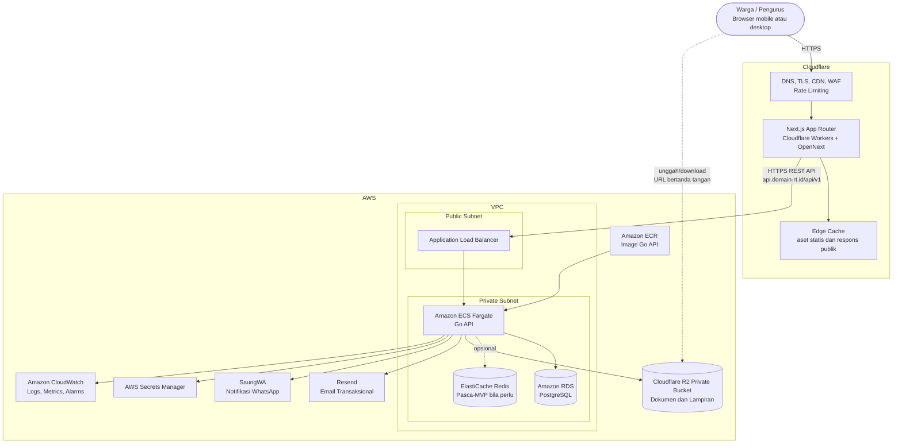
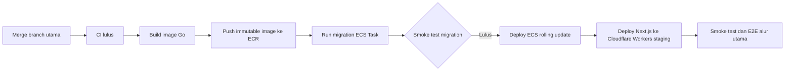

# Arsitektur Sistem RT Digital

**Status:** Draft untuk validasi  
**Cakupan:** MVP RT Digital  
**Referensi:** `PRD.md`, `SCOPE.md`, `DATABASE_DESIGN.md`, `USER_ROLES_AND_PERMISSIONS.md`

Dokumen ini menjelaskan hubungan frontend Next.js di Cloudflare, Go API di AWS, PostgreSQL, object storage, Redis bila diperlukan, Docker development, CI/CD, backup, serta monitoring.

---

## 1. Prinsip Arsitektur

1. **Mobile-first:** aset kecil, cache aman, respons API ringkas, dan unggah file langsung ke object storage.
2. **Modular monolith:** satu layanan Go API untuk MVP. Tidak ada microservice sebelum kebutuhan nyata terbukti.
3. **Backend sebagai sumber keputusan:** autentikasi, RBAC, scope `organization_id`, validasi, transaksi, dan audit diproses Go API.
4. **Stateless API:** container Go tidak menyimpan session di memori lokal.
5. **Data privat:** PostgreSQL dan object storage tidak dapat diakses publik.
6. **Cache aman:** respons berisi data pribadi tidak boleh tersimpan di CDN atau browser shared cache.
7. **Managed services:** gunakan layanan terkelola untuk database, container runtime, secret, backup, log, dan object storage.

---

## 2. Arsitektur Tingkat Tinggi



---

## 3. Komponen dan Tanggung Jawab

## 3.1 Cloudflare dan Next.js

| Komponen | Tanggung jawab |
|---|---|
| Cloudflare DNS | Mengarahkan domain aplikasi dan API. |
| TLS | Menyediakan HTTPS untuk seluruh koneksi publik. |
| CDN/edge cache | Menyajikan aset statis Next.js: JavaScript, CSS, font, gambar publik. |
| WAF dan rate limiting | Melindungi endpoint publik, login, reset kata sandi, dan unggah. |
| Cloudflare Workers | Menjalankan Next.js App Router melalui OpenNext. |
| Next.js | UI responsive desktop-first, routing, Server Components, PWA manifest, validasi UX, dan komunikasi API. |

**Domain:**

| Domain | Fungsi |
|---|---|
| `app.domain-rt.id` | Frontend Next.js. |
| `api.domain-rt.id` | Go REST API melalui ALB AWS. |

**Aturan cache:**

- Aset ber-hash dapat menggunakan cache jangka panjang.
- Halaman publik dapat dicache bila tidak memuat data pribadi.
- Halaman login, dashboard, tagihan, profil, surat, aduan, notifikasi, dan semua respons autentikasi memakai `Cache-Control: private, no-store`.
- Worker tidak menyimpan token atau data warga pada edge cache.
- Cookie dan CORS hanya berlaku untuk domain resmi.

## 3.2 Go API di Amazon ECS Fargate

| Aspek | Keputusan |
|---|---|
| Bahasa | Go |
| Gaya arsitektur | Modular monolith |
| Protokol | HTTPS REST API dengan prefix `/api/v1` |
| Runtime | Docker container pada Amazon ECS Fargate |
| Load balancing | AWS Application Load Balancer |
| Scaling | Horizontal berdasarkan CPU, memori, dan metrik request setelah beban membenarkan |
| Deploy | Image immutable dari Amazon ECR |
| State | Tidak menyimpan session/token di memori container |

**Tanggung jawab API:**

- Autentikasi, lifecycle session, MFA pengurus, dan logout seluruh perangkat.
- Otorisasi RBAC serta pembatasan data berdasarkan organisasi, kepemilikan keluarga, dan penugasan.
- Validasi input dan aturan bisnis.
- Transaksi PostgreSQL untuk pembayaran, kas, surat, aduan, dan audit log.
- Penerbitan URL unggah/download bertanda tangan untuk Cloudflare R2 melalui API S3-compatible.
- Pengiriman notifikasi dalam aplikasi serta email transaksional.
- Structured logging JSON dan penerusan `X-Request-ID`.

**Network:**

- ALB berada di public subnet.
- ECS Fargate berada di private subnet.
- Hanya ALB dapat mengirim traffic masuk ke ECS.
- API hanya dapat terhubung ke RDS, Cloudflare R2 melalui endpoint HTTPS S3-compatible, Resend, SaungWA, Secrets Manager, serta CloudWatch sesuai IAM dan aturan egress.
- Bila pembatasan akses memungkinkan, ALB menerima traffic hanya dari Cloudflare. Jangan mengandalkan header Cloudflare sebagai autentikasi.

## 3.3 PostgreSQL di Amazon RDS

| Aspek | Keputusan |
|---|---|
| Layanan | Amazon RDS for PostgreSQL |
| Fungsi | Sumber data utama untuk data warga, keuangan, surat, aduan, RBAC, notifikasi, audit, serta master data |
| Akses publik | Dinonaktifkan |
| Akses aplikasi | Hanya security group ECS Fargate |
| Enkripsi | Encryption at-rest dan koneksi TLS |
| Schema | Mengikuti `DATABASE_DESIGN.md` |
| Migration | Dijalankan sebagai task deployment terkontrol sebelum API versi baru aktif |

PostgreSQL menyimpan refresh token hash dan status pencabutan token pada MVP. Tidak ada ketergantungan Redis untuk session awal.

## 3.4 Object Storage: Cloudflare R2

Cloudflare R2 diakses melalui API S3-compatible untuk menyimpan file besar atau biner:

- Bukti transfer.
- Lampiran surat.
- PDF surat terbit.
- Lampiran aduan.
- Lampiran pengumuman.
- Logo RT.

**Alur unggah:**

1. Frontend meminta URL unggah kepada Go API.
2. API memeriksa autentikasi, permission, kepemilikan objek, jenis file, ukuran file, dan batas unggahan organisasi.
3. API membuat pre-signed upload URL S3-compatible dengan masa berlaku pendek.
4. Browser mengunggah langsung ke R2.
5. Frontend memberi tahu API setelah unggah selesai.
6. API memvalidasi metadata/checksum bila tersedia lalu menyimpan `file_objects` dan relasinya.

**Alur download:**

1. Browser meminta file melalui Go API.
2. API memeriksa permission dan scope data.
3. API menerbitkan pre-signed download URL berumur pendek.
4. Browser mengunduh langsung dari R2.

**Aturan:**

- Bucket selalu private.
- Tidak ada URL publik permanen.
- Retensi dan pemulihan objek R2 mengikuti fitur bucket yang tersedia serta kebijakan backup yang ditetapkan.
- CORS bucket hanya mengizinkan origin frontend resmi.
- Pemindaian malware ditunda pasca-MVP; validasi MIME type, ukuran, dan ekstensi tetap wajib pada MVP.

## 3.5 Redis: Tidak Dipakai pada MVP

Redis tidak diperlukan untuk MVP satu RT. Menambah Redis kini hanya menambah biaya, operasional, backup, serta titik kegagalan.

| Kebutuhan | Solusi MVP | Kapan Redis ditambahkan |
|---|---|---|
| Rate limiting | Cloudflare WAF/rate limiting, limit API bila perlu | Aturan rate limit memerlukan counter terdistribusi tingkat API |
| Refresh token/session | PostgreSQL dengan token hash dan pencabutan | Beban session menyebabkan database terukur menjadi bottleneck |
| Cache data | HTTP cache aman untuk respons publik | Query baca terukur menjadi bottleneck setelah indexing dan optimasi query |
| Job queue | Task sederhana/database job table bila benar-benar dibutuhkan | Volume email, laporan, atau retry membutuhkan worker queue terpisah |

Jika diperlukan, gunakan Amazon ElastiCache Redis di private subnet. Redis tidak menjadi sumber data utama; PostgreSQL tetap source of truth.

---

## 4. Alur Request Utama

## 4.1 Membuka Aplikasi

1. Pengguna membuka `app.domain-rt.id`.
2. Cloudflare menyajikan aset statis dari edge cache.
3. Next.js Worker merender halaman dinamis bila diperlukan.
4. Frontend meminta data privat ke `api.domain-rt.id`.
5. ALB meneruskan request HTTPS ke Go API ECS.
6. API memeriksa session, RBAC, `organization_id`, scope data, lalu membaca/menulis PostgreSQL.
7. API mengembalikan JSON ringkas dengan `request_id`.
8. Respons privat tidak dicache.

## 4.2 Unggah Bukti Pembayaran

1. Warga memilih bukti dari kamera atau galeri.
2. Frontend meminta URL unggah bertanda tangan.
3. Go API memvalidasi user, tagihan, tipe file, serta ukuran.
4. Browser mengunggah file langsung ke R2.
5. Frontend membuat payment record melalui Go API dengan idempotency key.
6. API menyimpan pembayaran status `pending`, membuat audit log, serta notifikasi Bendahara.
7. Bendahara memverifikasi melalui API.
8. API menjalankan transaksi database: payment terverifikasi, invoice diperbarui, cash transaction dibuat, audit log dan notifikasi warga dicatat.

## 4.3 Pengiriman Email

1. Tindakan penting menghasilkan notification record di PostgreSQL.
2. API mengirim email melalui Resend (`https://resend.com`).
3. API mengirim notifikasi WhatsApp melalui SaungWA (`https://saungwa.com/`).
4. Kegagalan notifikasi dicatat tanpa membatalkan transaksi utama.
5. Retry asinkron ditambahkan bila volume atau kebutuhan reliabilitas membenarkan.

---

## 5. Lingkungan Development dengan Docker

Docker Compose digunakan agar frontend, API, database, dan email testing dapat dijalankan secara konsisten.

```text
web       Next.js development server
api       Go API dengan hot reload
postgres  PostgreSQL
```

**Opsional:**

```text
minio     Emulator S3 untuk pengujian upload/download lokal
```

**Prinsip:**

- Satu perintah menjalankan lingkungan lokal: `docker compose up`.
- Volume PostgreSQL lokal persisten.
- `.env.example` hanya berisi nama variabel dan nilai aman.
- Development memakai migration dan seed data terkontrol.
- Health check tersedia untuk PostgreSQL dan API.
- Container production menggunakan multi-stage build serta user non-root bila kompatibel.
- MinIO hanya ditambahkan saat fitur upload diuji; jangan memaksa dependency lokal bila belum diperlukan.

---

## 6. Lingkungan Deployment

| Lingkungan | Frontend | Backend | Database | Tujuan |
|---|---|---|---|---|
| Local | Docker Compose | Docker Compose | PostgreSQL container | Development |
| Test | CI runner | CI container | PostgreSQL ephemeral | Unit/integration test |
| Staging | Cloudflare Workers staging | ECS Fargate staging | RDS staging | UAT dan rehearsal migration |
| Production | Cloudflare Workers production | ECS Fargate production | RDS production | Pengguna nyata |

- Staging dan production memakai akun, secret, database, bucket, dan domain terpisah.
- Data production tidak disalin ke local/test tanpa anonymization.
- Image backend yang lolos staging dipromosikan ke production tanpa build ulang.

---

## 7. CI/CD

## 7.1 Pull Request CI

1. Install dependency dengan lockfile.
2. Lint frontend dan backend.
3. Type check Next.js/TypeScript.
4. Unit test frontend dan Go API.
5. Integration test Go API dengan PostgreSQL ephemeral.
6. Authorization test untuk peran utama.
7. Build frontend OpenNext dan image backend.
8. Dependency vulnerability scan.
9. Container image scan.
10. Preview deployment frontend bila pipeline tersedia.

## 7.2 Deployment Staging



- Migration dijalankan sekali sebagai ECS task, bukan oleh setiap replica API.
- Bila migration gagal, deployment API dihentikan.
- Migration berisiko memerlukan backup/snapshot dan rehearsal di staging.
- Deploy ECS memakai rolling update. Blue/green ditambahkan jika kebutuhan downtime/rollback membenarkan.
- Frontend deploy menggunakan Wrangler dan OpenNext.

## 7.3 Deployment Production

1. Approval manual.
2. Gunakan artifact frontend dan image backend yang sama dari staging.
3. Buat backup/snapshot sebelum migration berisiko.
4. Jalankan migration terkontrol.
5. Deploy ECS rolling update.
6. Jalankan health check ALB dan smoke test API.
7. Deploy Workers production.
8. Monitor error rate, latency, dan alarm selama periode rilis.
9. Roll back API/image atau frontend ke versi sebelumnya bila health check gagal.

---

## 8. Backup dan Pemulihan

| Komponen | Mekanisme | Target Awal |
|---|---|---|
| RDS PostgreSQL | Automated backup harian dan Point-in-Time Recovery | Retensi minimal 7 hari; target 14–30 hari sesuai anggaran |
| RDS sebelum migration berisiko | Snapshot manual | Wajib sebelum perubahan destruktif |
| Cloudflare R2 | Retensi dan pemulihan objek sesuai kemampuan bucket | Diuji pada production |
| Konfigurasi/infrastruktur | Infrastructure as Code dan repository version control | Rebuild environment harus terdokumentasi |
| Secret | Secrets Manager | Rotasi terkontrol; tidak diekspor ke repository |

**Target operasional awal:**

- RPO maksimal 24 jam.
- RTO maksimal 4 jam.
- Restore RDS dan pemulihan file R2 diuji berkala di staging.
- Hasil uji restore didokumentasikan dalam runbook.

---

## 9. Monitoring dan Observabilitas

## 9.1 Logging

- Go API menulis structured log JSON ke `stdout`.
- ECS mengirim log ke Amazon CloudWatch Logs.
- Frontend dan backend meneruskan `X-Request-ID`.
- Log memuat waktu, service, level, request ID, route, status HTTP, latency, dan error code.
- Log tidak memuat password, token, NIK, nomor KK, dokumen, bukti transfer, atau data sensitif lainnya.

## 9.2 Metrik dan Alarm

| Area | Metrik | Alarm awal |
|---|---|---|
| Cloudflare | WAF blocks, error edge, cache hit, Web Vitals | Lonjakan error atau blok abnormal |
| ALB | Request count, target 5xx, latency | 5xx tinggi atau target tidak sehat |
| ECS | CPU, memory, restart, task sehat | Resource tinggi berkelanjutan atau task unhealthy |
| Go API | Error rate, latency p95, auth failure, upload failure | Error rate/latency melewati baseline |
| RDS | CPU, koneksi, storage, IOPS, slow query | Storage rendah, koneksi tinggi, query lambat |
| Cloudflare R2 | Upload/download failure | Kegagalan akses atau lonjakan error |
| Email (Resend) | Delivery rate, bounce, complaint | Bounce atau complaint di atas ambang kebijakan |
| WhatsApp (SaungWA) | Delivery dan failure rate | Kegagalan kirim di atas ambang kebijakan |

## 9.3 Kesiapan Operasional

- Endpoint `/healthz` memeriksa proses API.
- Endpoint `/readyz` memeriksa dependency minimum sebelum target ALB menerima traffic.
- Health check tidak mengungkap detail internal.
- Alert dikirim ke pengurus teknis yang ditetapkan.
- Error tracking frontend eksternal hanya digunakan setelah evaluasi privasi.
- Runbook menangani: API down, RDS connection failure, gagal migration, upload R2 gagal, alarm error rate, dan pemulihan backup.

---

## 10. Keputusan MVP

| Keputusan | Pilihan |
|---|---|
| Frontend | Next.js App Router di Cloudflare Workers melalui OpenNext |
| Backend | Go modular monolith di Amazon ECS Fargate |
| Database | Amazon RDS PostgreSQL di private subnet |
| File | Cloudflare R2 private bucket melalui API S3-compatible |
| Cache/session | PostgreSQL dan Cloudflare; tanpa Redis |
| Container lokal | Docker Compose |
| CI/CD | GitHub Actions atau CI setara, ECR, ECS, Wrangler |
| Backup | RDS automated backup/PITR serta kebijakan retensi dan pemulihan Cloudflare R2 |
| Monitoring | Cloudflare analytics/WAF, CloudWatch Logs, Metrics, Alarms |